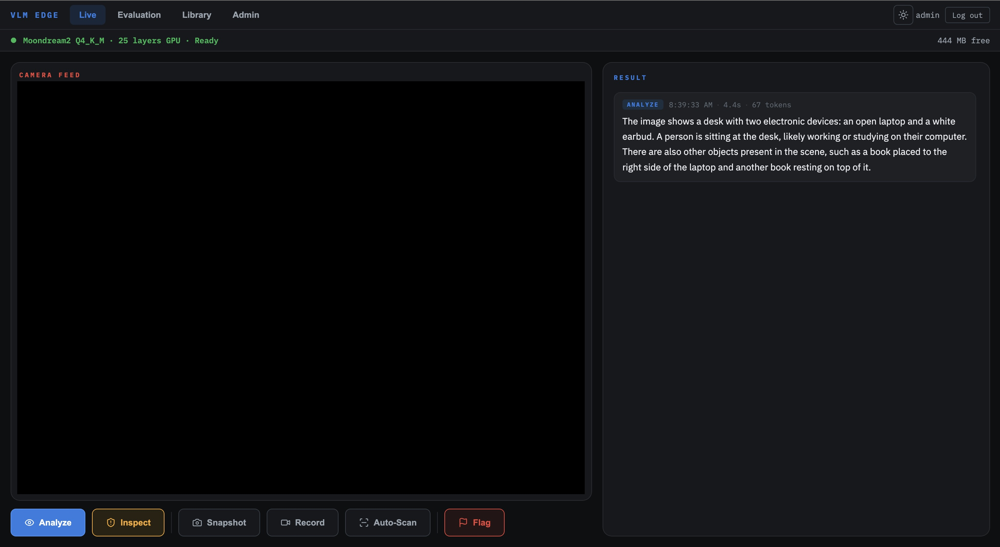
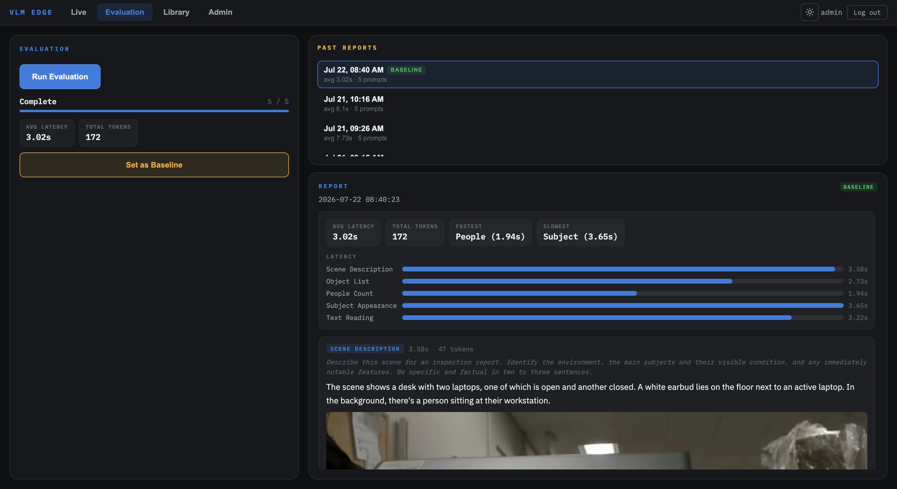
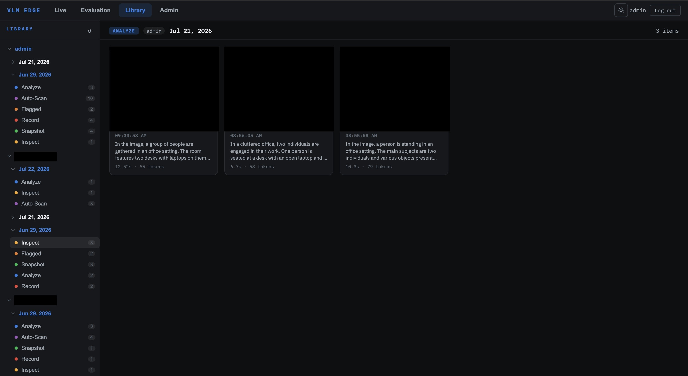
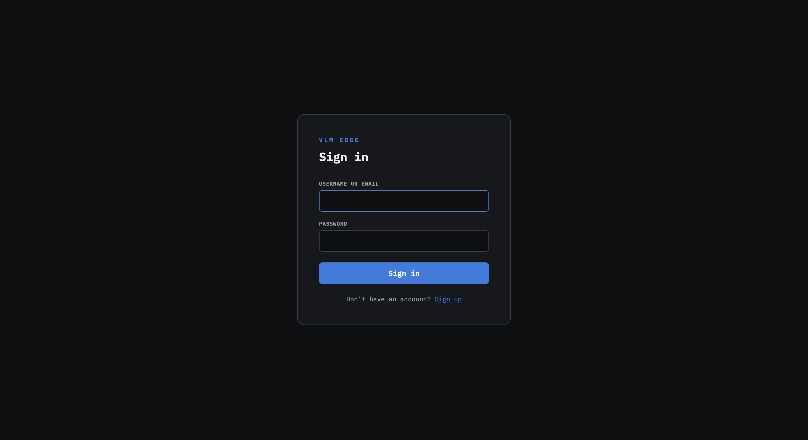
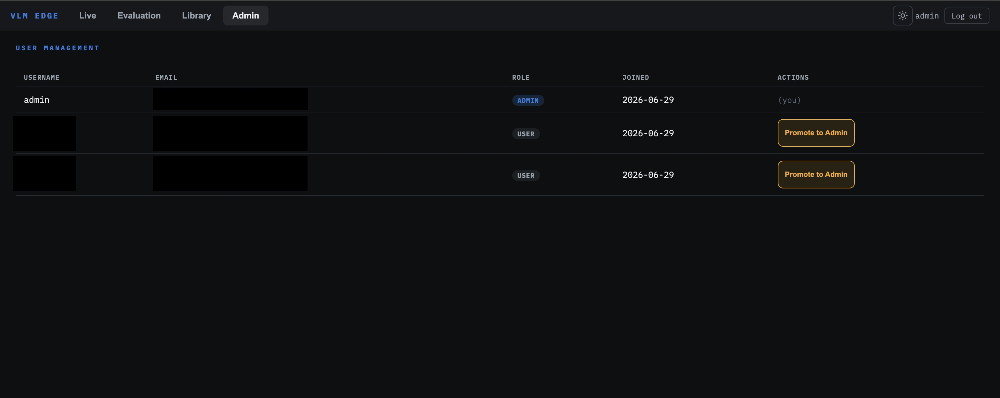

# Quantized VLM on Jetson Orin Nano

A real-time Vision-Language Model (VLM) running on the NVIDIA Jetson Orin Nano 8GB — capable of describing scenes, detecting hazards, and answering questions about a live camera feed, entirely on-device with no cloud dependency. Designed for **robotics and field inspection** use cases where the Jetson may be mounted on hardware with no attached display.

---

## What It Is

This project runs **Moondream2**, a 1.86B-parameter Vision-Language Model, quantized to 4-bit precision (GGUF Q4_K_M) and executed via **llama.cpp** with full CUDA GPU offloading on the Jetson's Ampere GPU. The result is a self-contained edge AI system that performs inference in roughly 3–6 seconds per query.

The application is a **web interface** served by FastAPI and built in React, accessible from any browser on the same LAN — no display required on the Jetson itself.

### Four modes

- **Live** — 30 FPS MJPEG camera feed with action buttons. Analyze a scene, run an inspection check, take a snapshot, record, flag a frame, or enable Auto-Scan for continuous periodic inference. Result history accumulates for the entire browser session.
- **Library** — Per-user media browser organized by date and action type. Preview images, play back recordings, and download snapshots, flagged frames, and recorded video. Admins see all users' outputs grouped by username.
- **Evaluation** — Run a structured 5-prompt benchmark against the live camera. View per-prompt latency, token count, a visual latency chart, and comparison deltas against a user-selected baseline. Admin accounts only.
- **Admin** — User management panel (admin accounts only). Promote or demote users between standard and admin roles.

---

## Screenshots

### Live


*Live camera feed with the action bar (Analyze, Inspect, Snapshot, Record, Auto-Scan, Flag). The status bar shows model state, GPU layers, and free memory; results accumulate in the panel on the right.*

---

### Evaluation


*Admin-only evaluation view. Run the 5-prompt suite, promote a run to baseline, and read per-prompt latency, token counts, the latency chart against the baseline, and each response beside the frame captured at inference time.*

---

### Library


*Per-user media browser organized by date and action type. Admins see every user's outputs; each card shows a response preview with its latency and token count. Downloads are offered for snapshots, flagged frames, and recordings.*

---

### Login


*Sign-in screen shown to unauthenticated visitors. Accepts a username or an email address.*

---

### Admin


*User management, admin accounts only. Each row shows the role badge; admins can promote standard users or demote other admins, and their own row reads "(you)" instead of an action button.*

---

## Stack

| Component | Choice | Why |
|---|---|---|
| Model | Moondream2 1.86B | Purpose-built for edge vision tasks; smallest capable open VLM |
| Quantization | Q4_K_M (GGUF) | ~877 MB on disk; best quality/size tradeoff at 4-bit |
| Inference runtime | llama.cpp + llama-cpp-python | Native CUDA support on Jetson; no TensorRT conversion needed |
| GPU offloading | 25 layers on CUDA | ~22 tokens/second on the Orin Nano's 1024-core Ampere GPU |
| Vision projector | mmproj F16 (~868 MB) | Full-precision multimodal projection; kept at F16 |
| Camera | OpenCV (UVC/USB) | Hardware-agnostic; works with any USB webcam |
| Backend | FastAPI + Uvicorn | Serves inference endpoints, MJPEG stream, and eval routes |
| Frontend | React + TypeScript (Vite) | Dark navy dashboard; accessible from any LAN device |
| Auth | JWT (PyJWT) + bcrypt | 24-hour signed tokens stored in `sessionStorage`; bcrypt password hashing called directly |
| User storage | SQLite (stdlib) | Single-file database; stores users and per-user output history |
| Python packaging | uv (Astral) | Manages `.venv` + dependency install from `pyproject.toml`; no pip/manual venv steps |
| Platform | Jetson Orin Nano 8GB, JetPack 7.2 | 8 GB unified RAM shared between CPU and GPU |

---

## Setup — Jetson Orin Nano 8GB

These instructions assume a **fresh JetPack 7.2** installation with the Jetson connected to the internet and a USB camera plugged in.

### 1. Clone the repository

```bash
git clone <your-repo-url> ~/Documents/Projects/Quantized-VLM
cd ~/Documents/Projects/Quantized-VLM
```

### 2. Get the model files

> **Important:** The official Moondream2 GGUF repository (`moondream/moondream2-gguf` on Hugging Face) only publishes F16 weights — there is no pre-quantized Q4_K_M for download. Download F16 and quantize locally using `llama-quantize`.

**Step 2a — Download the F16 files:**

```
models/
  moondream2-text-model-f16.gguf   (~2.7 GB)
  moondream2-mmproj-f16.gguf       (~868 MB)
```

Search `moondream/moondream2-gguf` on [huggingface.co](https://huggingface.co) and download both files into the `models/` folder.

**Step 2b — Quantize the text model to Q4_K_M:**

```bash
llama.cpp/build/bin/llama-quantize \
  models/moondream2-text-model-f16.gguf \
  models/moondream2-text-model-Q4_K_M.gguf \
  Q4_K_M
```

The mmproj stays at F16 — do not quantize it. After this step:

```
models/
  moondream2-text-model-f16.gguf      (2.7 GB — can delete after quantizing)
  moondream2-text-model-Q4_K_M.gguf   (877 MB — this is what the app loads)
  moondream2-mmproj-f16.gguf          (868 MB)
```

### 3. Install uv

This project uses [uv](https://docs.astral.sh/uv/) (Astral's Python package/project manager) instead of pip. uv creates and manages the virtual environment for you — there is no separate `python -m venv` step.

```bash
curl -LsSf https://astral.sh/uv/install.sh | sh
```

### 4. Install Python dependencies (including llama-cpp-python with CUDA support)

> **Critical:** `llama-cpp-python` builds without CUDA by default. Export the flags below *before* syncing so uv's build step compiles it with CUDA support — GPU offloading will not work otherwise.

```bash
PATH=/usr/local/cuda/bin:$PATH \
CMAKE_ARGS="-DGGML_CUDA=ON -DCMAKE_CUDA_ARCHITECTURES=87" \
uv sync
```

This creates `.venv/` at the repo root and installs everything from `pyproject.toml`. The `llama-cpp-python` build takes 10–20 minutes on the Jetson. `CUDA_ARCHITECTURES=87` targets the Orin Nano's Ampere GPU (SM 8.7).

### 5. Build the frontend

```bash
cd frontend
npm install
npm run build
cd ..
```

The built files are placed in `frontend/dist/` and served as a static SPA by the FastAPI backend.

### 6. Launch the application

```bash
cd backend
uv run uvicorn server:app --host 0.0.0.0 --port 8000
```

On **first startup**, if no admin account exists, the server seeds one and prints the credentials to the console. **Read them from the terminal, they are not stored anywhere else.** If you lose that output, delete `output/vlmedge.db` and restart to force a fresh re-seed.

#### Configuration environment variables

All of these are optional. When they are unset the server generates safe values, so a fresh clone runs without editing anything.

| Variable | Default | Purpose |
|---|---|---|
| `ADMIN_PASSWORD` | randomly generated, printed once on first boot | Password for the seeded admin account. Set it to choose your own. |
| `ADMIN_USERNAME` | `admin` | Username for the seeded admin account. |
| `ADMIN_EMAIL` | `admin@vlmedge.local` | Email for the seeded admin account. |
| `JWT_SECRET` | generated once into `output/.jwt_secret` (chmod 600) | Signing key for auth tokens. Kept out of git and persists across restarts. |
| `CAMERA_INDEX` | `0` | Which `/dev/video*` device to open. |

> **Security:** set `ADMIN_PASSWORD` before the first launch if you want to choose it yourself. Change the admin username and email through the Admin panel after logging in. The signing key in `output/.jwt_secret` never enters git; a leaked key would let anyone forge admin tokens, so treat it as a secret.

```bash
ADMIN_PASSWORD="choose-a-strong-password" uv run uvicorn server:app --host 0.0.0.0 --port 8000
```

Model loading takes approximately 10 seconds. Once the status bar shows **Ready**, the interface is fully operational. Navigate to the login page from any device on the same network:

> **Session behavior:** the login token is stored in `sessionStorage`. Closing the browser window ends the session and requires re-login. Page refresh keeps the session alive. Opening a new browser tab starts a fresh session.

```
http://<JETSON_IP>:8000
```

This is a web-only interface. Everything is reached through the browser, so no application needs to be installed on the client device.

---

## Project Structure

```
Quantized-VLM/
├── pyproject.toml                   # Python deps (uv-managed); .venv lives at repo root
├── backend/
│   ├── app/
│   │   ├── api/
│   │   │   ├── auth_routes.py       # /auth/* routes (signup, login, me) + get_current_user / require_admin deps
│   │   │   ├── admin_routes.py      # /admin/* routes (list users, promote, demote)
│   │   │   ├── camera_thread.py     # Pure-Python camera loop (30 FPS MJPEG buffer)
│   │   │   ├── routes.py            # FastAPI routes: stream, analyze, inspect, snapshot, record, autoscan, flag
│   │   │   ├── eval_routes.py       # Evaluation routes (admin-only): run, status, reports, report, frame, set-baseline
│   │   │   └── library_routes.py    # Library routes: per-user outputs, admin view, file serve (?token= auth)
│   │   ├── core/
│   │   │   ├── config.py            # Model paths, output directories, auth config
│   │   │   └── database.py          # SQLite init, CRUD helpers (users + outputs tables)
│   │   └── services/
│   │       ├── capture.py           # Camera open/capture/release helpers
│   │       └── eval.py              # Inference, annotation, report generation, evaluation prompts
│   └── server.py                    # FastAPI app entry point + lifespan (model load, camera start, DB init) + /health
├── launch.sh                        # Starts the server, waits on /health, opens the browser
├── frontend/
│   ├── src/
│   │   ├── app/
│   │   │   ├── components/          # EvalRunner, ReportList, ReportViewer, CameraFeed, ButtonPanel, ResultPanel, PasswordStrengthBar
│   │   │   ├── context/             # AuthContext (sessionStorage token, login/logout, 401 handler)
│   │   │   ├── hooks/               # useStatus, useEvalStatus
│   │   │   ├── pages/               # Dashboard, EvalPage, LibraryPage, LoginPage, SignupPage, AdminPage
│   │   │   └── services/api.ts      # Typed fetch wrappers for all backend endpoints (Bearer injection)
│   │   ├── App.tsx                  # Auth routing + nav bar + page routing
│   │   └── index.css                # Dark navy theme
│   ├── index.html
│   └── vite.config.ts
├── models/                          # GGUF model files (not tracked in git)
├── output/                          # Snapshots, recordings, eval reports (not tracked)
└── docs/
    ├── screenshots/                 # UI screenshots used in this README
    └── documentation/               # CLAUDE.md, BRIEFING.md, LEARNING.md
```

---

## Hardware Requirements

| Resource | Requirement |
|---|---|
| Device | NVIDIA Jetson Orin Nano 8GB |
| JetPack | 7.2 (Ubuntu 24.04 base) |
| RAM | 8 GB unified (model uses ~2.5 GB at load) |
| Storage | ~4.4 GB during setup (all three model files present), ~1.7 GB after deleting the F16 text model |
| Camera | Any USB/UVC webcam |
| Network | LAN connection for remote browser access |
| CUDA | Included with JetPack — no separate install |
